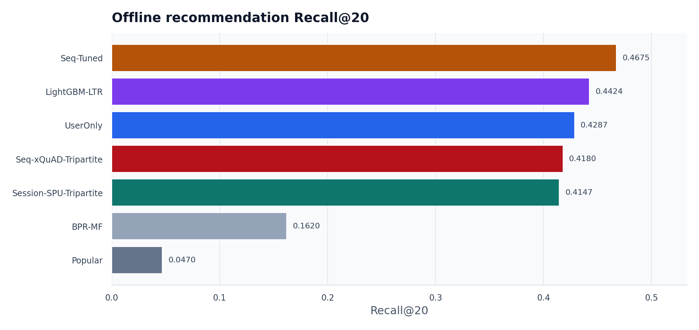
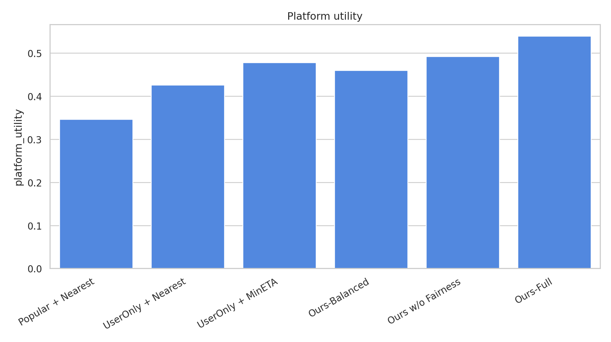
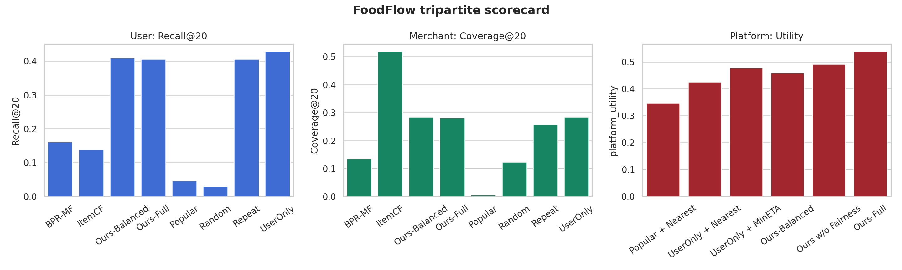

# FoodFlow：外卖三方推荐与动态履约仿真系统

中山大学《大数据原理》期末工程实践项目。FoodFlow 面向外卖平台推荐场景，基于公开 TRD 外卖订单数据实现用户-商家 Top-K 推荐，并进一步把推荐结果接入订单-骑手匹配与动态履约仿真，用推荐指标和系统级指标共同评价策略效果。

项目核心观点：外卖推荐不能只看 Recall 或 NDCG。推荐列表会改变订单的空间分布，进而影响商家曝光、骑手负载、预计送达时间和超时风险。因此本项目将推荐系统扩展为“用户、商家、骑手”三方闭环。

## 项目亮点

- 用户侧推荐：实现 Random、Popular、Repeat、ItemCF、BPR-MF、UserOnly、Ours-Full 等策略。
- 商家侧公平：在重排中引入商家曝光公平、长尾曝光与 Exposure Gini 等指标。
- 骑手侧履约：模拟订单-骑手匹配，比较最近骑手、最小 ETA、负载感知三类策略。
- 动态仿真：模拟午餐高峰多时间步请求，持续更新骑手状态和订单履约结果。
- 多指标评估：同时输出 Recall、NDCG、MRR、HitRate、Coverage、Exposure Gini、Avg ETA、Timeout Rate、Rider Load Std、Platform Utility。
- 工程闭环：提供 Makefile、CLI、测试、图表、实验报告、Streamlit demo 和 NotebookLM PPT 素材包。

## 数据来源

主数据集为 Takeout Recommendation Dataset (TRD)：

- DOI：`10.5281/zenodo.8025855`
- 地址：<https://zenodo.org/records/8025855>
- 来源：美团外卖北京 11 个商圈
- 时间：2021-03-01 至 2021-03-28
- 使用文件：用户、商家、菜品、训练订单、测试订单和测试标签

项目默认下载 TRD 的 txt 文件，不下载约 1.8GB 的 `graph.bin`，因为核心实现不依赖 DGL 图文件。TRD 不包含完整骑手状态和真实派单记录，因此骑手位置、在线状态、负载、可靠性和收入为固定 seed 合成 proxy，仅用于履约仿真，不声称为真实骑手数据。

## 方法概览

FoodFlow 的主流程如下：

```text
TRD 数据下载与清洗
  -> 用户/商家/菜品/订单特征构建
  -> 用户-商家 Top-K 推荐
  -> 三方重排：用户偏好 + 商家公平 + ETA + 供给分
  -> 模拟下单
  -> 订单-骑手匹配
  -> 午餐高峰动态履约仿真
  -> 指标、图表、报告与 demo
```

Ours-Full 推荐分数采用可解释加权重排：

```text
score = 0.62 * user_score
      + 0.18 * merchant_fairness
      + 0.14 * eta_score
      + 0.06 * supply_score
```

其中 `user_score` 表示用户偏好，`merchant_fairness` 表示商家曝光补偿，`eta_score` 表示预计履约时间，`supply_score` 表示商家供给可行性。

## 项目结构

```text
foodflow/
  cli.py             # 命令行入口
  download.py        # TRD 下载
  preprocess.py      # 数据清洗与特征处理
  data.py            # 处理后数据加载
  recommenders.py    # 推荐基线与 Ours-Full
  rerank.py          # ETA、公平分、供给分等重排特征
  rider_sim.py       # 骑手生成、ETA 估计、订单匹配
  simulator.py       # 动态履约仿真
  metrics.py         # 推荐与公平指标
  evaluate.py        # 离线推荐评估
  figures.py         # 图表生成
  report.py          # 实验报告生成
  explain.py         # 推荐解释

app.py               # Streamlit demo
Makefile             # 常用运行命令
outputs/             # 指标 CSV 与图表
report/              # 实验报告
ppt/notebooklm/      # NotebookLM PPT 生成素材包
tests/               # 单元测试与集成 smoke 测试
```

## 快速开始

推荐使用 conda 环境：

```bash
git clone git@github.com:HSZGB/FoodFlow.git
cd FoodFlow
make conda-setup
conda activate foodflow
```

如果不使用 conda，也可以运行 `make setup` 创建 `.venv`。不要直接用系统 `python3 -m foodflow.cli` 跑完整流程，因为系统环境可能缺少 pandas、matplotlib 等依赖。

### 1. 快速 smoke 测试

使用 mock 数据完整跑通流程：

```bash
make smoke
```

该命令会执行：

```text
mock-data -> preprocess -> eval-offline -> simulate -> figures -> report -> test
```

### 2. 真实 TRD 数据实验

快速复现实验默认抽样 5 万训练订单：

```bash
make download
make preprocess
make eval
make simulate
make audit
make figures
make report
```

也可以一行运行：

```bash
make download preprocess eval simulate audit figures report
```

如果要使用完整 TRD 训练集：

```bash
make download
make preprocess-full
make eval
make simulate
make audit
make figures
make report
```

### 3. 运行测试

```bash
make test
```

### 4. 启动 demo

```bash
make demo
```

`make demo` 默认使用 conda 环境中的 Streamlit。如果需要临时改用其它 Streamlit，可覆盖变量，例如：

```bash
make STREAMLIT=".venv/bin/streamlit" demo
```

如果需要指定端口：

```bash
make STREAMLIT_FLAGS="--server.port 8502" demo
```

然后在浏览器打开：

```text
http://localhost:8501
```

demo 默认展示用户 `8`，也可以在侧边栏输入其它用户 ID。当前界面包含推荐商家卡片、用户品类偏好、Ours-Full 分数组成、同一订单的骑手策略 ETA 对比、用户-商家-骑手链路图、空间散点图和实验指标看板。

## 主要输出

```text
outputs/results/offline_metrics.csv       # 离线推荐指标
outputs/results/simulation_metrics.csv    # 动态履约仿真指标
outputs/results/data_audit.json           # TRD 完整性与抽样审计
outputs/figures/*.png                     # 实验图表
docs/DATA_AUDIT.md                        # 数据审计 Markdown
report/实验报告.md                        # 实验报告
ppt/notebooklm/upload_pack/               # NotebookLM PPT 上传素材包
```

重新生成 NotebookLM 上传包：

```bash
python3 scripts/prepare_notebooklm_pack.py
```

## 实验结果摘要

当前提交的结果已经使用完整 TRD `orders_train.txt`，数据审计显示原始训练订单 `1,068,495` 条，处理后训练订单 `1,068,495` 条，训练订单使用比例 `1.0000`。

离线推荐中，`UserOnly` 的 Recall@20 最高，为 `0.4287`；`Ours-Balanced` 的 Recall@20 为 `0.4097`，`Ours-Full` 的 Recall@20 为 `0.4055`，与 UserOnly 差距较小，同时保留了履约与供给约束。

动态履约仿真中，`Ours-Full` 取得最低平均 ETA、最低超时率和最高平台综合效用：

| 策略 | Avg ETA | Timeout Rate | Platform Utility |
|---|---:|---:|---:|
| UserOnly + Nearest | 95.41 | 0.8182 | 0.4255 |
| UserOnly + MinETA | 53.86 | 0.6517 | 0.4779 |
| Ours-Balanced | 59.00 | 0.7941 | 0.4597 |
| Ours-Full | 46.78 | 0.4725 | 0.5394 |

结论不是“单一模型在所有指标上最优”，而是：Ours-Full 牺牲一部分离线准确性，换取更低 ETA、更低超时率和更高平台综合效用，更符合外卖平台的多主体优化目标。

## 图表示例







## 局限与说明

- 骑手数据为合成 proxy，不能替代真实派单数据。
- BPR-MF 是轻量实现，未追求大规模深度模型最优性能。
- 项目没有实现 LightGCN、KGAT 或完整知识图谱模型，这些作为调研背景和后续增强方向。
- 平台效用权重是课程项目中的解释性设置，后续可做权重敏感性分析。
- 当前三方优化采用“推荐重排 + 下单后骑手匹配”的解耦闭环，不是工业级端到端联合调度系统。

## 课程交付材料

- 作业要求：`作业要求.md`
- 硬性要求：`硬性要求.md`
- 项目计划：`PROJECT_PLAN.md`
- 数据来源说明：`docs/DATA_SOURCE.md`
- 实验报告：`report/实验报告.md`
- PPT 生成材料：`ppt/notebooklm/`
