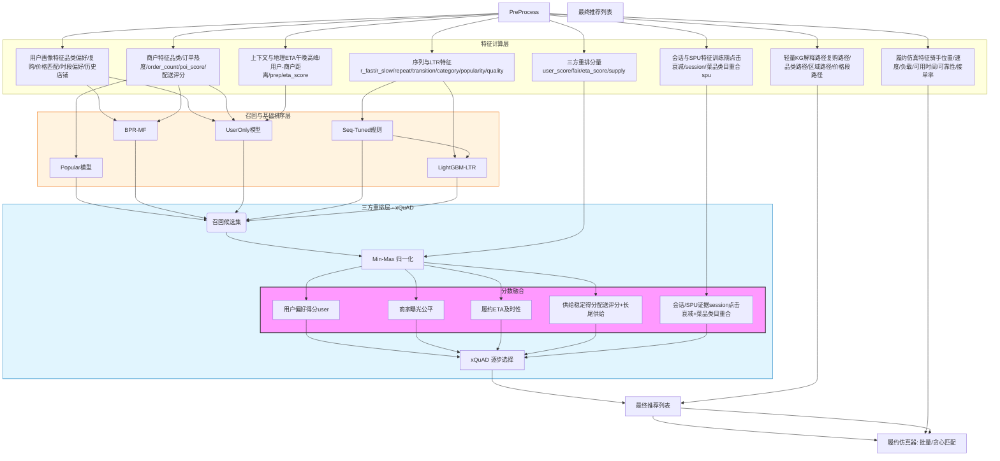
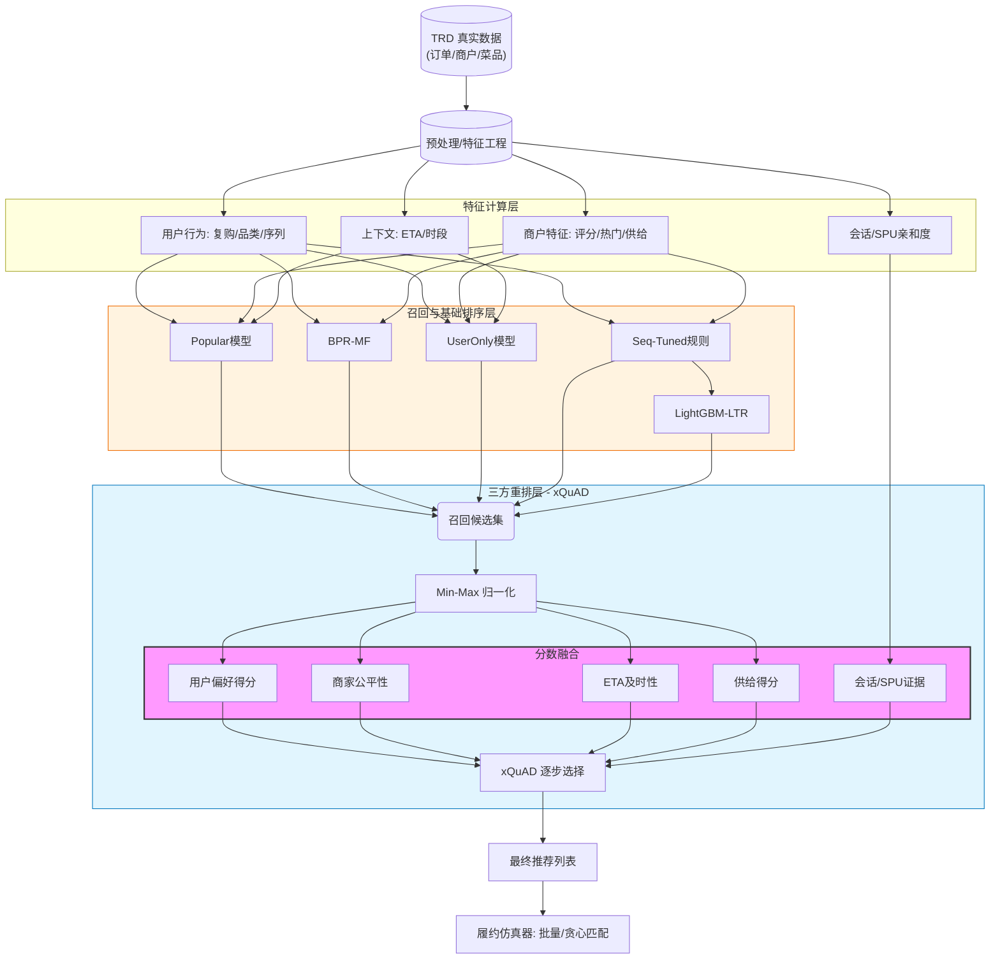

```mermaid
graph TD
    %% 数据    InputData[("TRD 真实数据(订单/用户/商户/会话/SPU菜品)")] --> PreProcess[("预处理/特征工程")]

    %% 特征定义
    subgraph FeatureEngineering [特征计算层]
        direction TB
        F_User[用户画像特征品类偏好/复购/价格匹配/时段偏好/历史店铺]
        F_Merchant[商户特征品类/订单热度/order_count/poi_score/配送评分]
        F_Seq[序列与LTR特征r_fast/r_slow/repeat/transition/category/popularity/quality]
        F_Context[上下文与地理ETA午晚高峰/用户-商户距离/prep/eta_score]
        F_Tripartite[三方重排分量user_score/fair/eta_score/supply]
        F_Session[会话与SPU特征训练期点击衰减/session/菜品类目重合spu]
        F_KG[轻量KG解释路径复购路径/品类路径/区域路径/价格段路径]
        F_Rider[履约仿真特征骑手位置/速度/负载/可用时间/可靠性/接单率]
    end
  
    PreProcess --> F_User & F_Merchant & F_Seq & F_Context & F_Tripartite & F_Session & F_KG & F_Rider

    %% 召回与基础排序
    subgraph Recall_Rank [召回与基础排序层]
        direction TB
        Popular[Popular模型]
        BPR[BPR-MF]
        UserOnly[UserOnly模型]
        SeqTuned[Seq-Tuned规则]
        LightGBM[LightGBM-LTR]
    end

    F_Merchant --> Popular
    F_User & F_Merchant --> BPR
    F_User & F_Merchant & F_Context --> UserOnly
    F_Seq --> SeqTuned
    F_Seq --> LightGBM
    SeqTuned --> LightGBM

    %% 三方重排 (核心融合逻辑)
    subgraph ReRanking [三方重排层 - xQuAD]
        direction TB
        Input_Candidates(召回候选集)
      
        Normalization[Min-Max 归一化]
      
        subgraph Fusion [分数融合]
            UserScore[用户偏好得分user]
            Fairness[商家曝光公平]
            ETA[履约ETA及时性]
            Supply[供给稳定得分配送评分+长尾供给]
            SessionSPU[会话/SPU证据session点击衰减+菜品类目重合]
        end
      
        xQuAD_Select[xQuAD 逐步选择]
    end

    %% 模型链路
    Popular & BPR & UserOnly & SeqTuned & LightGBM --> Input_Candidates
    Input_Candidates --> Normalization
  
    F_Tripartite --> Normalization
    Normalization --> UserScore & Fairness & ETA & Supply
    F_Session --> SessionSPU
  
    UserScore & Fairness & ETA & Supply & SessionSPU --> xQuAD_Select
  
    %% 输出
    xQuAD_Select --> OutputRec[最终推荐列表]
    F_KG --> OutputRec
    OutputRec --> Simulator[履约仿真器: 批量/贪心匹配]
    F_Rider --> Simulator
tputRec[最终推荐列表]
    OutputRec --> Simulator[履约仿真器: 批量/贪心匹配]

    %% 样式
    style Fusion fill:#f9f,stroke:#333,stroke-width:2px
    style ReRanking fill:#e1f5fe,stroke:#0277bd
    style Recall_Rank fill:#fff3e0,stroke:#ef6c00
```

```mermaid
graph TD
    %% 数据源
    InputData[("TRD 真实数据<br/>(订单/商户/菜品)")] --> PreProcess[("预处理/特征工程")]

    %% 特征定义
    subgraph FeatureEngineering [特征计算层]
        direction TB
        F_User[用户行为: 复购/品类/序列]
        F_Merchant[商户特征: 评分/热门/供给]
        F_Context[上下文: ETA/时段]
        F_Session[会话/SPU亲和度]
    end
    
    PreProcess --> F_User & F_Merchant & F_Context & F_Session

    %% 召回与基础排序
    subgraph Recall_Rank [召回与基础排序层]
        direction TB
        Popular[Popular模型]
        BPR[BPR-MF]
        UserOnly[UserOnly模型]
        SeqTuned[Seq-Tuned规则]
        LightGBM[LightGBM-LTR]
    end

    F_User & F_Merchant & F_Context --> Popular
    F_User & F_Merchant --> BPR
    F_User & F_Merchant & F_Context --> UserOnly
    F_User & F_Merchant --> SeqTuned
    SeqTuned --> LightGBM

    %% 三方重排 (核心融合逻辑)
    subgraph ReRanking [三方重排层 - xQuAD]
        direction TB
        Input_Candidates(召回候选集)
        
        Normalization[Min-Max 归一化]
        
        subgraph Fusion [分数融合]
            UserScore[用户偏好得分]
            Fairness[商家公平性]
            ETA[ETA及时性]
            Supply[供给得分]
            SessionSPU[会话/SPU证据]
        end
        
        xQuAD_Select[xQuAD 逐步选择]
    end

    %% 模型链路
    Popular & BPR & UserOnly & SeqTuned & LightGBM --> Input_Candidates
    Input_Candidates --> Normalization
    
    Normalization --> UserScore & Fairness & ETA & Supply
    F_Session --> SessionSPU
    
    UserScore & Fairness & ETA & Supply & SessionSPU --> xQuAD_Select
    
    %% 输出
    xQuAD_Select --> OutputRec[最终推荐列表]
    OutputRec --> Simulator[履约仿真器: 批量/贪心匹配]

    %% 样式
    style Fusion fill:#f9f,stroke:#333,stroke-width:2px
    style ReRanking fill:#e1f5fe,stroke:#0277bd
    style Recall_Rank fill:#fff3e0,stroke:#ef6c00
```