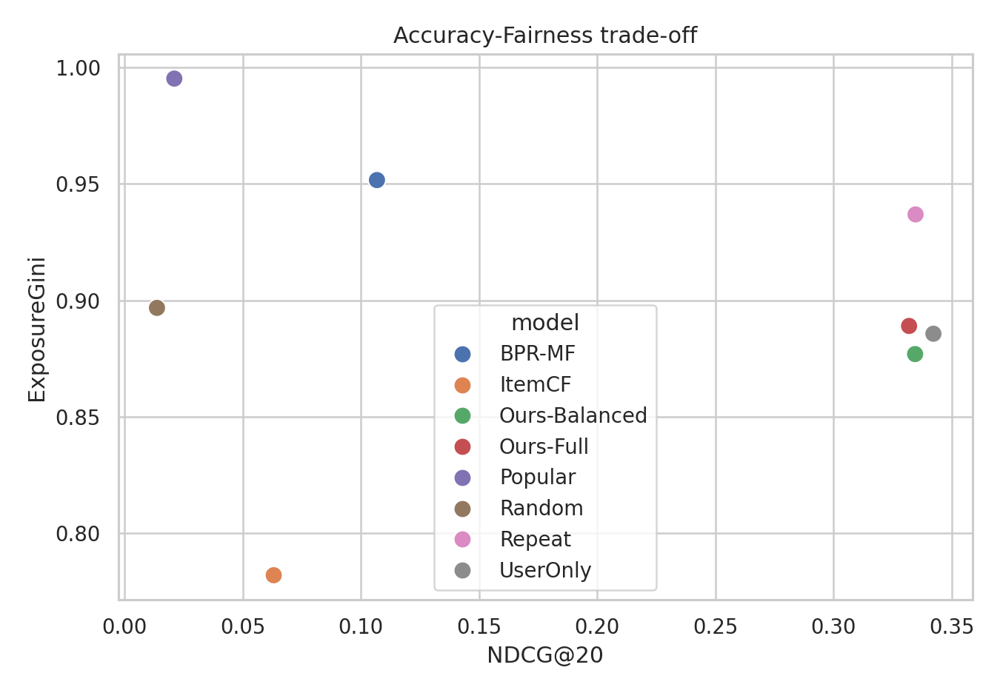
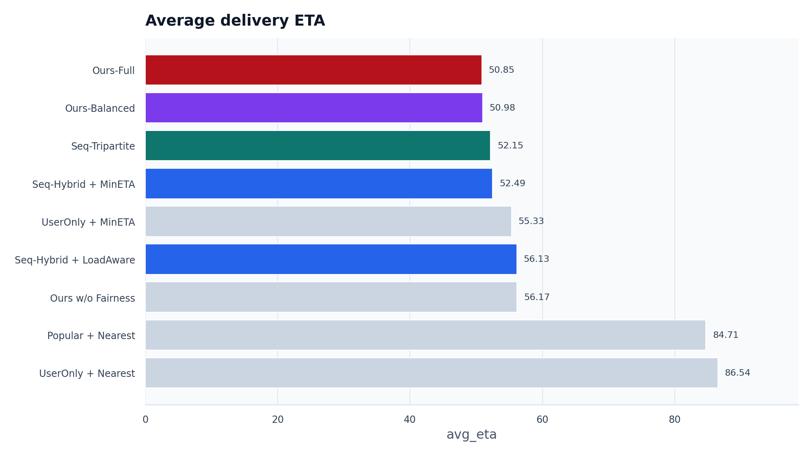

# FoodFlow 答辩 PPT 大纲（草稿，待审批）

Slide 1: FoodFlow：外卖三方推荐与动态履约仿真系统
- Key points: 项目名称、课程大作业、用户 × 商家 × 骑手三方视角。
- Visual idea: 外卖平台三方关系图，中心为推荐系统。
- Layout role and intent: cover。
- Required source images: none。

Slide 2: 为什么外卖推荐不能只看 Recall
- Key points: 推荐会影响订单空间分布；订单进一步影响骑手、ETA、超时和商家曝光；只看命中率会漏掉履约风险。
- Visual idea: “推荐 -> 下单 -> 派单 -> 配送状态更新”的链路。
- Layout role and intent: problem framing。
- Required source images: none。

Slide 3: 数据来源与可复现边界
- Key points: TRD 来自 Zenodo；包含用户、商家、菜品、订单和测试标签；骑手数据为固定 seed 合成 proxy；不下载 1.8GB graph.bin。
- Visual idea: 数据表关系图和来源引用条。
- Layout role and intent: data evidence。
- Required source images: none。

Slide 4: 系统总体架构
- Key points: 数据处理、召回排序、三方重排、骑手匹配、动态仿真、指标评估；所有模块可由 Makefile 重复执行。
- Visual idea: 横向流水线架构图。
- Layout role and intent: architecture。
- Required source images: none。

Slide 5: 推荐算法与三方重排
- Key points: Popular/BPR-MF/UserOnly/Seq-Tuned/Seq-xQuAD-Tripartite；Seq-xQuAD-Tripartite 在用户偏好外加入列表覆盖、商家公平、ETA 和供给分；解释只引用真实参与打分的特征。
- Visual idea: 打分公式拆解和模型对照表。
- Layout role and intent: method comparison。
- Required source images: none。

Slide 6: 离线推荐指标结果
- Key points: 展示 Recall@20、NDCG@20、Coverage@20 和 Exposure Gini；说明准确性和曝光公平的 trade-off。
- Visual idea: 指标柱状图 + trade-off 散点图。
- Layout role and intent: data evidence。
- Required source images:
  - Main evidence figure; strict input asset after experiment generation; preserve labels and values.

    

  - Accuracy-fairness trade-off; strict input asset after experiment generation; preserve axes and legends.

    

Slide 7: 动态履约仿真设计
- Key points: 午餐高峰多时间步；推荐列表产生模拟订单；最近骑手、最小 ETA、负载感知三类匹配；骑手状态随订单更新。
- Visual idea: 离散时间仿真循环图。
- Layout role and intent: process explanation。
- Required source images: none。

Slide 8: 三方策略的系统级指标
- Key points: 对比 Popular + Nearest、UserOnly + MinETA、Seq-Tuned + MinETA、Seq-xQuAD-Tripartite；展示 ETA、超时率、骑手负载和平台效用。
- Visual idea: 仿真指标四联图。
- Layout role and intent: data evidence。
- Required source images:
  - Simulation ETA and platform utility figures; strict input assets after experiment generation; preserve values.

    

    

Slide 9: 案例解释：一次推荐如何兼顾三方
- Key points: 用户画像；Top-K 商家；推荐解释；匹配骑手；预计送达时间；说明推荐不是黑箱。
- Visual idea: 左侧用户画像，中间推荐列表，右侧骑手匹配卡片。
- Layout role and intent: case study。
- Required source images: none。

Slide 10: 结论、局限与改进方向
- Key points: 推荐有效、重排改善商家公平、履约感知提升系统指标；局限是骑手为合成 proxy；后续可接入真实派单或图模型。
- Visual idea: 三个结论卡片 + 一个局限说明。
- Layout role and intent: summary。
- Required source images: none。

Slide 11: Q&A
- Key points: 数据可复现、指标可对比、模块可运行。
- Visual idea: 简洁收束页。
- Layout role and intent: Q&A。
- Required source images: none。
