# FoodFlow：融合学习排序、公平重排与履约仿真的外卖推荐系统

## 1. 项目目标

FoodFlow 面向外卖平台推荐场景，先用真实外卖订单数据评估用户-商家 Top-K 推荐，再把推荐结果转化为模拟订单，进入骑手匹配与高峰期履约仿真。项目同时观察推荐准确性、商家曝光公平、ETA、超时率、骑手负载和平台综合效用。

核心观点是：外卖推荐不能只追求 Recall 或 NDCG。一个推荐列表如果把用户推向远距离、高拥堵、骑手供给不足的商家，平台体验可能变差。因此 FoodFlow 在用户偏好之外引入商家公平、ETA、供给约束和骑手负载。

## 2. 数据来源

主数据集为 Takeout Recommendation Dataset (TRD)，Zenodo DOI：`10.5281/zenodo.8025855`。数据来自美团外卖北京 11 个商圈，时间范围为 2021-03-01 至 2021-03-28，包含用户、餐厅、菜品、训练订单、测试订单和测试标签。

项目默认下载 TRD 的 txt 文件，不下载约 1.8GB 的 `graph.bin`，因为核心实现不依赖 DGL 图。TRD 不包含真实骑手状态和派单记录，因此默认骑手位置、在线状态、负载和收入为固定 seed 合成 proxy。若提供 LaDe delivery CSV，系统可从 task-accept/task-finish 时空事件估计骑手速度、服务时长和任务重叠负载，但 LaDe 不是外卖平台数据，不能声称为真实外卖派单记录。

TRD 亦不含坐标。项目用 `geocode` 把用户/商家嵌入 LaDe 真实城市（烟台核心区）的配送 GPS 密度分布：商圈映射到真实高密度簇、用户从真实配送点采样（`data/processed/geo_note.json` 记录口径）。实体的具体位置仍是合成分配，但空间分布、距离与 ETA 具备真实城市尺度；行程按直线距离 × 1.3 道路弯曲系数换算，备餐与骑手赶店并行计时。

当前表格由真实 TRD txt 文件生成，训练集使用完整 `orders_train.txt`。审计记录显示原始训练订单 1068495 条，处理后训练订单 1068495 条。

### 2.1 数据审计

| 项目          | 值                                            |
|:------------|:---------------------------------------------|
| 必需 TRD 文件齐全 | True                                         |
| 训练集处理模式     | full                                         |
| 原始训练订单数     | 1068495                                      |
| 处理后训练订单数    | 1068495                                      |
| 训练订单使用比例    | 1.0000                                       |
| 骑手数据边界      | 默认合成 proxy；可用 LaDe delivery CSV 校准，非真实外卖派单记录 |

## 3. 方法设计

默认实验保留 8 个代表策略：Popular、BPR-MF、UserOnly、Seq-Tuned、Logistic-LTR、Seq-xQuAD-Tripartite、Session-SPU-Tripartite 和 KG-Tripartite。LightGBM 不可用时显式使用 Logistic-LTR；Session-SPU-Tripartite 只使用训练期点击会话与菜品信号，避免把测试期行为泄漏到离线排序；KG-Tripartite 在其上叠加时间衰减的知识图谱兴趣信号（品类/商圈/价位节点的关系加权匹配），是 kg-demo 子项目动态 KG 注意力模型的免训练近似。

Popular 是全局热度对照；BPR-MF 是传统隐式反馈矩阵分解；UserOnly 使用品类、复购、价格、时段和商家质量构造可解释画像分；LightGBM-LTR 复用 Seq-Tuned 的 recency、repeat、transition、category、popularity、quality 等特征，但用 LightGBM LambdaRank 学习排序函数，替代手动硬编码的 `SEQ_TUNED_WEIGHTS`；Seq-xQuAD-Tripartite 把列表级覆盖、商家公平、ETA 和供给约束接到同一个重排器；Session-SPU-Tripartite 进一步加入 TRD session 点击候选和菜品 SPU 类目偏好，用来评估更丰富的真实行为信号是否改善履约链路。

`Seq-Tuned` 保留为可解释规则基线；LightGBM 不可用时，系统使用 Logistic-LTR，而不是把规则模型伪装成学习排序。仿真共 11 条链路：三方重排系列运行逐单贪心与容量槽位批量最大权匹配，另有**路径感知顺路派单**两档——骑手维护取/送航点序列，新单按 cheapest-insertion 计算边际绕行成本（RouteBatch 目标 = 绕行 + ETA 等权、RouteMinETA 只最小化该单 ETA），批量版按匈牙利轮次匹配，骑手沿路径行进而非派单即瞬移，并输出平均绕行分钟数与顺路接单率。各策略共享请求流和初始骑手池，同一推荐器还共享 MNL 选择噪声，减少随机场景差异。仿真支持多随机种子重复运行（`--simulation-seeds`），结果表在均值之外报告跨种子标准差与 95% 置信区间，策略间对比以该口径为准。

轻量 KG 解释用于吸收知识图谱路线的可解释性亮点，但不引入高风险图神经网络训练。系统从训练订单、商家品类、商圈/区域和价格段构造 `user-ordered-poi`、`user-prefers-category`、`poi-has-category`、`poi-located-in-area`、`has-price-range` 等路径。`explain-case` 会输出类似 “user -> category <- poi” 的证据路径，并同时保留 ETA、曝光补偿等真实打分字段，避免空泛模板解释。

三方重排的用户分、公平分、ETA 分和供给分在候选集合内做 min-max 归一化后再加权合成，避免不同数值尺度让权重失去解释性。离线表中 `LightGBM-LTR` 更突出覆盖改善和曝光集中度下降；`Seq-xQuAD-Tripartite` 的价值则主要体现在把商家公平、ETA、供给和列表级覆盖纳入排序，并需要结合后续履约仿真判断系统级收益。

## 4. 离线推荐结果

| model                  |   Recall@10 |   NDCG@10 |   MRR@10 |   HitRate@10 |   RepeatRecall@10 |   ExploreRecall@10 |   Recall@20 |   NDCG@20 |   MRR@20 |   HitRate@20 |   RepeatRecall@20 |   ExploreRecall@20 |   Coverage@20 |   ExposureGini |   LongTailExposure@20 |   CategoryJSD@20 |
|:-----------------------|------------:|----------:|---------:|-------------:|------------------:|-------------------:|------------:|----------:|---------:|-------------:|------------------:|-------------------:|--------------:|---------------:|----------------------:|-----------------:|
| BPR-MF                 |      0.1269 |    0.0968 |   0.1108 |       0.1967 |            0.2989 |             0.0158 |      0.162  |    0.1068 |   0.1141 |       0.2433 |            0.3416 |             0.0407 |        0.135  |         0.9516 |                0.0592 |           0.0575 |
| KG-Tripartite          |      0.4048 |    0.3412 |   0.3848 |       0.5633 |            0.9865 |             0.0249 |      0.4263 |    0.348  |   0.3859 |       0.58   |            0.9988 |             0.0535 |        0.2927 |         0.8746 |                0.4296 |           0.0157 |
| Logistic-LTR           |      0.3961 |    0.3392 |   0.3851 |       0.55   |            0.9901 |             0.0101 |      0.4013 |    0.3412 |   0.3852 |       0.5533 |            1      |             0.0124 |        0.429  |         0.8282 |                0.6559 |           0.4736 |
| Popular                |      0.0219 |    0.0135 |   0.018  |       0.0467 |            0.0278 |             0.0219 |      0.047  |    0.021  |   0.0209 |       0.09   |            0.0782 |             0.0309 |        0.0062 |         0.9952 |                0      |           0.0581 |
| Seq-Tuned              |      0.4187 |    0.3504 |   0.392  |       0.58   |            0.9889 |             0.0489 |      0.4675 |    0.3652 |   0.3948 |       0.6267 |            0.9988 |             0.1245 |        0.2884 |         0.8927 |                0.4371 |           0.0152 |
| Seq-xQuAD-Tripartite   |      0.3954 |    0.3377 |   0.3816 |       0.55   |            0.9865 |             0.0144 |      0.4113 |    0.3426 |   0.3821 |       0.56   |            0.9988 |             0.0302 |        0.2823 |         0.8904 |                0.4314 |           0.0154 |
| Session-SPU-Tripartite |      0.3937 |    0.3369 |   0.3826 |       0.55   |            0.9865 |             0.0099 |      0.4119 |    0.3429 |   0.3834 |       0.56   |            0.9988 |             0.0339 |        0.2884 |         0.8818 |                0.4286 |           0.0158 |
| UserOnly               |      0.3988 |    0.3336 |   0.373  |       0.5467 |            0.9904 |             0.0158 |      0.4287 |    0.3423 |   0.3747 |       0.5733 |            0.9988 |             0.0586 |        0.2841 |         0.8857 |                0.4242 |           0.0156 |

推荐侧指标使用 Recall@K、NDCG@K、MRR@K 和 HitRate@K；RepeatRecall@K 只统计测试真值中用户训练期点过的复购商家，ExploreRecall@K 只统计训练期未点过的新商家，用来拆开“复购命中”和“探索命中”。商家侧指标使用 Coverage、Long-tail Exposure 和 Exposure Gini；校准侧指标使用 CategoryJSD@20，衡量推荐列表品类分布与用户历史品类分布的 Jensen-Shannon divergence，数值越低越贴近用户习惯。这样既能看推荐是否命中真实下单，也能看曝光是否过度集中，以及列表是否偏离用户长期品类偏好。全量 TRD 结果中，Seq-Tuned 或 Logistic-LTR 通常代表离线准确率前沿，说明外卖推荐强烈受复购序列和商家转移影响；Seq-xQuAD-Tripartite 的离线准确性可能低于纯用户侧序列模型，但它把商家曝光和履约约束纳入同一条链路，需要结合仿真指标判断系统级收益。

## 5. 动态履约仿真结果

| policy                          | recommender            | rider_policy    | assignment_mode   | choice_model   |   n_seeds |   completed_orders |   completed_orders_std |   completed_orders_ci95 |   total_orders |   total_orders_std |   total_orders_ci95 |   unassigned_orders |   unassigned_orders_std |   unassigned_orders_ci95 |   completion_rate |   completion_rate_std |   completion_rate_ci95 |   avg_eta |   avg_eta_std |   avg_eta_ci95 |   p95_eta |   p95_eta_std |   p95_eta_ci95 |   timeout_rate |   timeout_rate_std |   timeout_rate_ci95 |   on_time_rate |   on_time_rate_std |   on_time_rate_ci95 |   avg_rider_load |   avg_rider_load_std |   avg_rider_load_ci95 |   rider_load_std |   rider_load_std_std |   rider_load_std_ci95 |   rider_load_cv |   rider_load_cv_std |   rider_load_cv_ci95 |   active_rider_rate |   active_rider_rate_std |   active_rider_rate_ci95 |   rider_income_gini |   rider_income_gini_std |   rider_income_gini_ci95 |   merchant_exposure_gini |   merchant_exposure_gini_std |   merchant_exposure_gini_ci95 |   user_satisfaction |   user_satisfaction_std |   user_satisfaction_ci95 |   rider_speed_kmph |   rider_speed_kmph_std |   rider_speed_kmph_ci95 |   rider_service_minutes |   rider_service_minutes_std |   rider_service_minutes_ci95 |   avg_detour_minutes |   avg_detour_minutes_std |   avg_detour_minutes_ci95 |   enroute_pickup_share |   enroute_pickup_share_std |   enroute_pickup_share_ci95 |   platform_utility |   platform_utility_std |   platform_utility_ci95 |
|:--------------------------------|:-----------------------|:----------------|:------------------|:---------------|----------:|-------------------:|-----------------------:|------------------------:|---------------:|-------------------:|--------------------:|--------------------:|------------------------:|-------------------------:|------------------:|----------------------:|-----------------------:|----------:|--------------:|---------------:|----------:|--------------:|---------------:|---------------:|-------------------:|--------------------:|---------------:|-------------------:|--------------------:|-----------------:|---------------------:|----------------------:|-----------------:|---------------------:|----------------------:|----------------:|--------------------:|---------------------:|--------------------:|------------------------:|-------------------------:|--------------------:|------------------------:|-------------------------:|-------------------------:|-----------------------------:|------------------------------:|--------------------:|------------------------:|-------------------------:|-------------------:|-----------------------:|------------------------:|------------------------:|----------------------------:|-----------------------------:|---------------------:|-------------------------:|--------------------------:|-----------------------:|---------------------------:|----------------------------:|-------------------:|-----------------------:|------------------------:|
| Popular + Nearest               | popular                | nearest         | greedy            | mnl_softmax    |        10 |               81.4 |                 4.5509 |                  2.8207 |           81.4 |             4.5509 |              2.8207 |                   0 |                       0 |                        0 |                 1 |                     0 |                      0 |   59.0572 |        3.6857 |         2.2844 |  112.757  |        7.5921 |         4.7056 |         0.5791 |             0.0369 |              0.0229 |         0.4209 |             0.0369 |              0.0229 |           0.7417 |               0.0696 |                0.0431 |           1.0719 |               0.0387 |                0.024  |          1      |              0      |               0      |              0.3383 |                  0.0255 |                   0.0158 |              0.7572 |                  0.0161 |                   0.01   |                   0.9997 |                       0      |                        0      |              0.4587 |                  0.0084 |                   0.0052 |            24.9962 |                 0.2889 |                  0.1791 |                  9.8889 |                      0.1387 |                       0.0859 |               0      |                   0      |                    0      |                 0      |                     0      |                      0      |             0.391  |                 0.0105 |                  0.0065 |
| UserOnly + MinETA               | useronly               | min_eta         | greedy            | mnl_softmax    |        10 |               89.9 |                 7.6804 |                  4.7604 |           89.9 |             7.6804 |              4.7604 |                   0 |                       0 |                        0 |                 1 |                     0 |                      0 |   41.5415 |        1.9781 |         1.226  |   64.1851 |        6.1924 |         3.8381 |         0.3473 |             0.0499 |              0.0309 |         0.6527 |             0.0499 |              0.0309 |           0.7492 |               0.0777 |                0.0482 |           0.7236 |               0.0258 |                0.016  |          0.9539 |              0.0609 |               0.0378 |              0.5817 |                  0.0464 |                   0.0288 |              0.5246 |                  0.0414 |                   0.0256 |                   0.99   |                       0.0006 |                        0.0003 |              0.6383 |                  0.0365 |                   0.0226 |            24.9962 |                 0.2889 |                  0.1791 |                  9.8889 |                      0.1387 |                       0.0859 |               0      |                   0      |                    0      |                 0      |                     0      |                      0      |             0.5115 |                 0.0137 |                  0.0085 |
| Seq-Tuned + MinETA              | seq_tuned              | min_eta         | greedy            | mnl_softmax    |        10 |               86.1 |                 5.4457 |                  3.3753 |           86.1 |             5.4457 |              3.3753 |                   0 |                       0 |                        0 |                 1 |                     0 |                      0 |   40.4387 |        1.9521 |         1.2099 |   64.4462 |        6.2315 |         3.8624 |         0.2872 |             0.0661 |              0.0409 |         0.7128 |             0.0661 |              0.0409 |           0.7167 |               0.0761 |                0.0472 |           0.7052 |               0.0157 |                0.0097 |          0.9718 |              0.0413 |               0.0256 |              0.5692 |                  0.0314 |                   0.0195 |              0.5309 |                  0.0243 |                   0.0151 |                   0.9895 |                       0.0004 |                        0.0002 |              0.6594 |                  0.0386 |                   0.0239 |            24.9962 |                 0.2889 |                  0.1791 |                  9.8889 |                      0.1387 |                       0.0859 |               0      |                   0      |                    0      |                 0      |                     0      |                      0      |             0.5331 |                 0.0193 |                  0.012  |
| Logistic-LTR + MinETA           | learned_ltr            | min_eta         | greedy            | mnl_softmax    |        10 |               93.2 |                 6.5115 |                  4.0359 |           93.2 |             6.5115 |              4.0359 |                   0 |                       0 |                        0 |                 1 |                     0 |                      0 |   40.4482 |        1.7905 |         1.1097 |   63.6904 |        4.9148 |         3.0463 |         0.2992 |             0.0456 |              0.0282 |         0.7008 |             0.0456 |              0.0282 |           0.78   |               0.0468 |                0.029  |           0.7299 |               0.0402 |                0.0249 |          0.9335 |              0.0554 |               0.0343 |              0.5983 |                  0.0394 |                   0.0244 |              0.5117 |                  0.0353 |                   0.0219 |                   0.9843 |                       0.0014 |                        0.0009 |              0.6353 |                  0.0278 |                   0.0172 |            24.9962 |                 0.2889 |                  0.1791 |                  9.8889 |                      0.1387 |                       0.0859 |               0      |                   0      |                    0      |                 0      |                     0      |                      0      |             0.5281 |                 0.017  |                  0.0105 |
| Seq-xQuAD-Tripartite + Greedy   | seq_xquad_tripartite   | load_aware      | greedy            | mnl_softmax    |        10 |               86.7 |                 6.4987 |                  4.0279 |           86.7 |             6.4987 |              4.0279 |                   0 |                       0 |                        0 |                 1 |                     0 |                      0 |   37.0416 |        3.0748 |         1.9058 |   58.9959 |        6.3061 |         3.9085 |         0.2122 |             0.0746 |              0.0462 |         0.7878 |             0.0746 |              0.0462 |           0.6283 |               0.0714 |                0.0442 |           0.7202 |               0.0306 |                0.019  |          0.956  |              0.0448 |               0.0278 |              0.5625 |                  0.0555 |                   0.0344 |              0.5323 |                  0.0491 |                   0.0304 |                   0.9892 |                       0.0005 |                        0.0003 |              0.6321 |                  0.0288 |                   0.0178 |            24.9962 |                 0.2889 |                  0.1791 |                  9.8889 |                      0.1387 |                       0.0859 |               0      |                   0      |                    0      |                 0      |                     0      |                      0      |             0.5504 |                 0.0197 |                  0.0122 |
| Seq-xQuAD-Tripartite + Batch    | seq_xquad_tripartite   | load_aware      | batch             | mnl_softmax    |        10 |               86.7 |                 6.4987 |                  4.0279 |           86.7 |             6.4987 |              4.0279 |                   0 |                       0 |                        0 |                 1 |                     0 |                      0 |   35.8955 |        3.031  |         1.8786 |   57.0255 |        6.3523 |         3.9372 |         0.1954 |             0.0587 |              0.0364 |         0.8046 |             0.0587 |              0.0364 |           0.6217 |               0.0757 |                0.0469 |           0.7465 |               0.0254 |                0.0158 |          0.9797 |              0.0269 |               0.0166 |              0.5542 |                  0.0499 |                   0.0309 |              0.546  |                  0.043  |                   0.0266 |                   0.9892 |                       0.0005 |                        0.0003 |              0.6321 |                  0.0288 |                   0.0178 |            24.9962 |                 0.2889 |                  0.1791 |                  9.8889 |                      0.1387 |                       0.0859 |               0      |                   0      |                    0      |                 0      |                     0      |                      0      |             0.5531 |                 0.0142 |                  0.0088 |
| Session-SPU-Tripartite + Batch  | session_spu_tripartite | load_aware      | batch             | mnl_softmax    |        10 |               89.8 |                 4.9396 |                  3.0616 |           89.8 |             4.9396 |              3.0616 |                   0 |                       0 |                        0 |                 1 |                     0 |                      0 |   36.794  |        2.0118 |         1.2469 |   58.3858 |        4.0205 |         2.4919 |         0.1995 |             0.0463 |              0.0287 |         0.8005 |             0.0463 |              0.0287 |           0.6742 |               0.0443 |                0.0275 |           0.7352 |               0.0387 |                0.024  |          0.9726 |              0.0452 |               0.028  |              0.5842 |                  0.031  |                   0.0192 |              0.5206 |                  0.0277 |                   0.0172 |                   0.9882 |                       0.0005 |                        0.0003 |              0.6504 |                  0.0298 |                   0.0185 |            24.9962 |                 0.2889 |                  0.1791 |                  9.8889 |                      0.1387 |                       0.0859 |               0      |                   0      |                    0      |                 0      |                     0      |                      0      |             0.5572 |                 0.0158 |                  0.0098 |
| Session-SPU-Tripartite + Greedy | session_spu_tripartite | load_aware      | greedy            | mnl_softmax    |        10 |               89.8 |                 4.9396 |                  3.0616 |           89.8 |             4.9396 |              3.0616 |                   0 |                       0 |                        0 |                 1 |                     0 |                      0 |   38.136  |        2.1847 |         1.3541 |   60.4826 |        4.5403 |         2.8141 |         0.2196 |             0.0502 |              0.0311 |         0.7804 |             0.0502 |              0.0311 |           0.6825 |               0.0376 |                0.0233 |           0.6872 |               0.0362 |                0.0224 |          0.9179 |              0.0537 |               0.0333 |              0.6067 |                  0.0316 |                   0.0196 |              0.4901 |                  0.03   |                   0.0186 |                   0.9882 |                       0.0005 |                        0.0003 |              0.6504 |                  0.0298 |                   0.0185 |            24.9962 |                 0.2889 |                  0.1791 |                  9.8889 |                      0.1387 |                       0.0859 |               0      |                   0      |                    0      |                 0      |                     0      |                      0      |             0.5567 |                 0.0182 |                  0.0113 |
| KG-Tripartite + Batch           | kg_tripartite          | load_aware      | batch             | mnl_softmax    |        10 |               89.7 |                 6.7503 |                  4.1839 |           89.7 |             6.7503 |              4.1839 |                   0 |                       0 |                        0 |                 1 |                     0 |                      0 |   36.9018 |        1.6806 |         1.0416 |   60.0793 |        4.356  |         2.6999 |         0.2114 |             0.0537 |              0.0333 |         0.7886 |             0.0537 |              0.0333 |           0.6642 |               0.0467 |                0.0289 |           0.7422 |               0.044  |                0.0273 |          0.9717 |              0.0402 |               0.0249 |              0.5758 |                  0.035  |                   0.0217 |              0.5279 |                  0.0315 |                   0.0195 |                   0.9878 |                       0.0006 |                        0.0003 |              0.6354 |                  0.0268 |                   0.0166 |            24.9962 |                 0.2889 |                  0.1791 |                  9.8889 |                      0.1387 |                       0.0859 |               0      |                   0      |                    0      |                 0      |                     0      |                      0      |             0.5501 |                 0.0185 |                  0.0115 |
| KG-Tripartite + RouteMinETA     | kg_tripartite          | route_min_eta   | route_batch       | mnl_softmax    |        10 |               89.7 |                 6.7503 |                  4.1839 |           89.7 |             6.7503 |              4.1839 |                   0 |                       0 |                        0 |                 1 |                     0 |                      0 |   36.1497 |        1.5494 |         0.9603 |   58.2528 |        4.9638 |         3.0766 |         0.2292 |             0.06   |              0.0372 |         0.7708 |             0.06   |              0.0372 |           1.0558 |               0.0484 |                0.03   |           1.2905 |               0.0658 |                0.0408 |          1      |              0      |               0      |              0.2892 |                  0.0261 |                   0.0162 |              0.7744 |                  0.0164 |                   0.0102 |                   0.9878 |                       0.0006 |                        0.0003 |              0.6354 |                  0.0268 |                   0.0166 |            24.9962 |                 0.2889 |                  0.1791 |                  9.8889 |                      0.1387 |                       0.0859 |              24.8008 |                   1.292  |                    0.8008 |                 0.5903 |                     0.0348 |                      0.0216 |             0.5419 |                 0.0173 |                  0.0107 |
| KG-Tripartite + RouteBatch      | kg_tripartite          | route_insertion | route_batch       | mnl_softmax    |        10 |               89.7 |                 6.7503 |                  4.1839 |           89.7 |             6.7503 |              4.1839 |                   0 |                       0 |                        0 |                 1 |                     0 |                      0 |   38.8418 |        1.9947 |         1.2363 |   64.2264 |        4.8207 |         2.9879 |         0.3108 |             0.0784 |              0.0486 |         0.6892 |             0.0784 |              0.0486 |           1.0808 |               0.0488 |                0.0302 |           1.3624 |               0.0598 |                0.0371 |          1      |              0      |               0      |              0.2592 |                  0.0178 |                   0.011  |              0.7913 |                  0.0144 |                   0.0089 |                   0.9878 |                       0.0006 |                        0.0003 |              0.6354 |                  0.0268 |                   0.0166 |            24.9962 |                 0.2889 |                  0.1791 |                  9.8889 |                      0.1387 |                       0.0859 |              20.6657 |                   1.4075 |                    0.8724 |                 0.6374 |                     0.0118 |                      0.0073 |             0.5174 |                 0.0222 |                  0.0137 |

履约侧指标包括完成和未分配订单数、平均/P95 ETA、超时率、骑手负载、活跃骑手比例、骑手收入 Gini、平台综合效用，以及路径感知派单的平均绕行分钟数与顺路接单率。多种子运行时，数值列为跨种子均值，并附 `_std` 与 `_ci95` 列。骑手速度、服务时长和初始负载可由外部配送任务 CSV 校准；传入 `--rider-tasks` 时会同步产出校准诊断 JSON，含逐参数来源标注（数据估计 vs 外卖默认）、经验分位数、对数正态拟合与仿真输入分布对任务数据的双样本 KS 检验。没有外部数据时继续使用固定 seed 的合成参数。

### 5.1 运力紧张压力场景（30 骑手）

把在线骑手从 120 名压缩到 30 名，模拟高峰爆单时的运力短缺。此场景下路径感知顺路派单（RouteMinETA/RouteBatch）显著优于容量槽位批量匹配：

| policy                          | recommender            | rider_policy    | assignment_mode   | choice_model   |   n_seeds |   completed_orders |   completed_orders_std |   completed_orders_ci95 |   total_orders |   total_orders_std |   total_orders_ci95 |   unassigned_orders |   unassigned_orders_std |   unassigned_orders_ci95 |   completion_rate |   completion_rate_std |   completion_rate_ci95 |   avg_eta |   avg_eta_std |   avg_eta_ci95 |   p95_eta |   p95_eta_std |   p95_eta_ci95 |   timeout_rate |   timeout_rate_std |   timeout_rate_ci95 |   on_time_rate |   on_time_rate_std |   on_time_rate_ci95 |   avg_rider_load |   avg_rider_load_std |   avg_rider_load_ci95 |   rider_load_std |   rider_load_std_std |   rider_load_std_ci95 |   rider_load_cv |   rider_load_cv_std |   rider_load_cv_ci95 |   active_rider_rate |   active_rider_rate_std |   active_rider_rate_ci95 |   rider_income_gini |   rider_income_gini_std |   rider_income_gini_ci95 |   merchant_exposure_gini |   merchant_exposure_gini_std |   merchant_exposure_gini_ci95 |   user_satisfaction |   user_satisfaction_std |   user_satisfaction_ci95 |   rider_speed_kmph |   rider_speed_kmph_std |   rider_speed_kmph_ci95 |   rider_service_minutes |   rider_service_minutes_std |   rider_service_minutes_ci95 |   avg_detour_minutes |   avg_detour_minutes_std |   avg_detour_minutes_ci95 |   enroute_pickup_share |   enroute_pickup_share_std |   enroute_pickup_share_ci95 |   platform_utility |   platform_utility_std |   platform_utility_ci95 |
|:--------------------------------|:-----------------------|:----------------|:------------------|:---------------|----------:|-------------------:|-----------------------:|------------------------:|---------------:|-------------------:|--------------------:|--------------------:|------------------------:|-------------------------:|------------------:|----------------------:|-----------------------:|----------:|--------------:|---------------:|----------:|--------------:|---------------:|---------------:|-------------------:|--------------------:|---------------:|-------------------:|--------------------:|-----------------:|---------------------:|----------------------:|-----------------:|---------------------:|----------------------:|----------------:|--------------------:|---------------------:|--------------------:|------------------------:|-------------------------:|--------------------:|------------------------:|-------------------------:|-------------------------:|-----------------------------:|------------------------------:|--------------------:|------------------------:|-------------------------:|-------------------:|-----------------------:|------------------------:|------------------------:|----------------------------:|-----------------------------:|---------------------:|-------------------------:|--------------------------:|-----------------------:|---------------------------:|----------------------------:|-------------------:|-----------------------:|------------------------:|
| Popular + Nearest               | popular                | nearest         | greedy            | mnl_softmax    |        10 |               79.8 |                 2.6583 |                  1.6476 |           81.4 |             4.5509 |              2.8207 |                 1.6 |                  3.6576 |                   2.267  |            0.982  |                0.0411 |                 0.0255 |   76.8556 |        4.1381 |         2.5648 |  142.201  |       10.0963 |         6.2577 |         0.7489 |             0.0474 |              0.0294 |         0.2511 |             0.0474 |              0.0294 |           2.8433 |               0.1134 |                0.0703 |           0.6525 |               0.1133 |                0.0702 |          0.2465 |              0.0488 |               0.0302 |              0.9933 |                  0.0141 |                   0.0087 |              0.1591 |                  0.0215 |                   0.0133 |                   0.9997 |                       0      |                        0      |              0.459  |                  0.0087 |                   0.0054 |            25.1183 |                 0.6585 |                  0.4082 |                  9.9865 |                      0.3194 |                        0.198 |               0      |                   0      |                    0      |                 0      |                     0      |                      0      |             0.4119 |                 0.0201 |                  0.0125 |
| UserOnly + MinETA               | useronly               | min_eta         | greedy            | mnl_softmax    |        10 |               83.2 |                 3.0478 |                  1.889  |           89.9 |             7.6804 |              4.7604 |                 6.7 |                  6.929  |                   4.2946 |            0.9303 |                0.0673 |                 0.0417 |   78.3493 |        3.0927 |         1.9169 |  135.296  |       11.5841 |         7.1799 |         0.8119 |             0.0255 |              0.0158 |         0.1881 |             0.0255 |              0.0158 |           2.9867 |               0.0422 |                0.0261 |           0.4208 |               0.0994 |                0.0616 |          0.153  |              0.0407 |               0.0252 |              1      |                  0      |                   0      |              0.1136 |                  0.0281 |                   0.0174 |                   0.99   |                       0.0006 |                        0.0003 |              0.6401 |                  0.0426 |                   0.0264 |            25.1183 |                 0.6585 |                  0.4082 |                  9.9865 |                      0.3194 |                        0.198 |               0      |                   0      |                    0      |                 0      |                     0      |                      0      |             0.4387 |                 0.02   |                  0.0124 |
| Seq-Tuned + MinETA              | seq_tuned              | min_eta         | greedy            | mnl_softmax    |        10 |               81.1 |                 3.178  |                  1.9698 |           86.1 |             5.4457 |              3.3753 |                 5   |                  7.3937 |                   4.5827 |            0.946  |                0.0782 |                 0.0485 |   76.6428 |        3.9632 |         2.4564 |  132.146  |       10.5229 |         6.5221 |         0.8193 |             0.023  |              0.0143 |         0.1807 |             0.023  |              0.0143 |           2.9467 |               0.0804 |                0.0499 |           0.4935 |               0.0964 |                0.0597 |          0.184  |              0.0432 |               0.0268 |              1      |                  0      |                   0      |              0.1248 |                  0.0364 |                   0.0225 |                   0.9895 |                       0.0004 |                        0.0002 |              0.6623 |                  0.0441 |                   0.0273 |            25.1183 |                 0.6585 |                  0.4082 |                  9.9865 |                      0.3194 |                        0.198 |               0      |                   0      |                    0      |                 0      |                     0      |                      0      |             0.4422 |                 0.0218 |                  0.0135 |
| Logistic-LTR + MinETA           | learned_ltr            | min_eta         | greedy            | mnl_softmax    |        10 |               81.8 |                 4.341  |                  2.6906 |           93.2 |             6.5115 |              4.0359 |                11.4 |                  7.2755 |                   4.5094 |            0.8811 |                0.0717 |                 0.0444 |   76.303  |        3.8341 |         2.3764 |  131.553  |       11.6857 |         7.2429 |         0.8126 |             0.0423 |              0.0262 |         0.1874 |             0.0423 |              0.0262 |           2.9933 |               0.0211 |                0.0131 |           0.4788 |               0.1382 |                0.0856 |          0.1784 |              0.0606 |               0.0376 |              1      |                  0      |                   0      |              0.126  |                  0.042  |                   0.026  |                   0.9843 |                       0.0014 |                        0.0009 |              0.6383 |                  0.0322 |                   0.02   |            25.1183 |                 0.6585 |                  0.4082 |                  9.9865 |                      0.3194 |                        0.198 |               0      |                   0      |                    0      |                 0      |                     0      |                      0      |             0.4265 |                 0.0203 |                  0.0126 |
| Seq-xQuAD-Tripartite + Greedy   | seq_xquad_tripartite   | load_aware      | greedy            | mnl_softmax    |        10 |               83.1 |                 3.8715 |                  2.3996 |           86.7 |             6.4987 |              4.0279 |                 3.6 |                  3.8355 |                   2.3773 |            0.9608 |                0.0408 |                 0.0253 |   72.3552 |        8.9852 |         5.5691 |  146.062  |       25.7456 |        15.9573 |         0.7464 |             0.0697 |              0.0432 |         0.2536 |             0.0697 |              0.0432 |           2.8967 |               0.1767 |                0.1095 |           0.4126 |               0.0758 |                0.047  |          0.1503 |              0.0336 |               0.0208 |              1      |                  0      |                   0      |              0.1407 |                  0.0316 |                   0.0196 |                   0.9892 |                       0.0005 |                        0.0003 |              0.6341 |                  0.0287 |                   0.0178 |            25.1183 |                 0.6585 |                  0.4082 |                  9.9865 |                      0.3194 |                        0.198 |               0      |                   0      |                    0      |                 0      |                     0      |                      0      |             0.4634 |                 0.0253 |                  0.0157 |
| Seq-xQuAD-Tripartite + Batch    | seq_xquad_tripartite   | load_aware      | batch             | mnl_softmax    |        10 |               83.9 |                 4.2544 |                  2.6369 |           86.7 |             6.4987 |              4.0279 |                 2.8 |                  3.2592 |                   2.0201 |            0.9696 |                0.0349 |                 0.0217 |   60.9596 |        7.8153 |         4.844  |  114.551  |       30.8512 |        19.1218 |         0.6793 |             0.0747 |              0.0463 |         0.3207 |             0.0747 |              0.0463 |           2.8867 |               0.1758 |                0.109  |           0.3848 |               0.1008 |                0.0625 |          0.1393 |              0.0421 |               0.0261 |              1      |                  0      |                   0      |              0.1159 |                  0.0259 |                   0.016  |                   0.9892 |                       0.0005 |                        0.0003 |              0.6318 |                  0.0292 |                   0.0181 |            25.1183 |                 0.6585 |                  0.4082 |                  9.9865 |                      0.3194 |                        0.198 |               0      |                   0      |                    0      |                 0      |                     0      |                      0      |             0.4858 |                 0.0275 |                  0.017  |
| Session-SPU-Tripartite + Batch  | session_spu_tripartite | load_aware      | batch             | mnl_softmax    |        10 |               86.3 |                 2.3118 |                  1.4329 |           89.8 |             4.9396 |              3.0616 |                 3.5 |                  4.2753 |                   2.6498 |            0.9629 |                0.0439 |                 0.0272 |   65.2308 |        5.0247 |         3.1143 |  123.324  |       17.2512 |        10.6924 |         0.7339 |             0.0449 |              0.0279 |         0.2661 |             0.0449 |              0.0279 |           2.9833 |               0.036  |                0.0223 |           0.3399 |               0.1243 |                0.0771 |          0.1192 |              0.0464 |               0.0288 |              1      |                  0      |                   0      |              0.1113 |                  0.0211 |                   0.0131 |                   0.9882 |                       0.0005 |                        0.0003 |              0.6507 |                  0.031  |                   0.0192 |            25.1183 |                 0.6585 |                  0.4082 |                  9.9865 |                      0.3194 |                        0.198 |               0      |                   0      |                    0      |                 0      |                     0      |                      0      |             0.4749 |                 0.0177 |                  0.0109 |
| Session-SPU-Tripartite + Greedy | session_spu_tripartite | load_aware      | greedy            | mnl_softmax    |        10 |               85.2 |                 2.4855 |                  1.5405 |           89.8 |             4.9396 |              3.0616 |                 4.6 |                  4.9035 |                   3.0392 |            0.9509 |                0.0508 |                 0.0315 |   77.4694 |        5.0416 |         3.1248 |  167.108  |       16.9856 |        10.5278 |         0.7938 |             0.0281 |              0.0174 |         0.2062 |             0.0281 |              0.0174 |           2.9833 |               0.0283 |                0.0176 |           0.3731 |               0.1002 |                0.0621 |          0.1323 |              0.039  |               0.0242 |              1      |                  0      |                   0      |              0.1434 |                  0.0253 |                   0.0157 |                   0.9882 |                       0.0005 |                        0.0003 |              0.6521 |                  0.0335 |                   0.0208 |            25.1183 |                 0.6585 |                  0.4082 |                  9.9865 |                      0.3194 |                        0.198 |               0      |                   0      |                    0      |                 0      |                     0      |                      0      |             0.4536 |                 0.0149 |                  0.0092 |
| KG-Tripartite + Batch           | kg_tripartite          | load_aware      | batch             | mnl_softmax    |        10 |               84.8 |                 2.8597 |                  1.7724 |           89.7 |             6.7503 |              4.1839 |                 4.9 |                  5.6263 |                   3.4872 |            0.9489 |                0.0568 |                 0.0352 |   61.4691 |        4.6031 |         2.8531 |  115.826  |       14.1578 |         8.7751 |         0.6854 |             0.0622 |              0.0386 |         0.3146 |             0.0622 |              0.0386 |           2.9367 |               0.1036 |                0.0642 |           0.384  |               0.1261 |                0.0782 |          0.1373 |              0.049  |               0.0304 |              1      |                  0      |                   0      |              0.1094 |                  0.0319 |                   0.0197 |                   0.9878 |                       0.0006 |                        0.0003 |              0.6348 |                  0.0312 |                   0.0193 |            25.1183 |                 0.6585 |                  0.4082 |                  9.9865 |                      0.3194 |                        0.198 |               0      |                   0      |                    0      |                 0      |                     0      |                      0      |             0.481  |                 0.0225 |                  0.014  |
| KG-Tripartite + RouteMinETA     | kg_tripartite          | route_min_eta   | route_batch       | mnl_softmax    |        10 |               89.5 |                 6.4334 |                  3.9875 |           89.7 |             6.7503 |              4.1839 |                 0.2 |                  0.6325 |                   0.392  |            0.998  |                0.0063 |                 0.0039 |   44.8754 |        2.4987 |         1.5487 |   74.0644 |        6.177  |         3.8286 |         0.4573 |             0.0685 |              0.0425 |         0.5427 |             0.0685 |              0.0425 |           2.7233 |               0.1988 |                0.1232 |           0.8521 |               0.2767 |                0.1715 |          0.2919 |              0.1082 |               0.0671 |              0.97   |                  0.0367 |                   0.0227 |              0.1496 |                  0.0561 |                   0.0348 |                   0.9878 |                       0.0006 |                        0.0003 |              0.6351 |                  0.0272 |                   0.0169 |            25.1183 |                 0.6585 |                  0.4082 |                  9.9865 |                      0.3194 |                        0.198 |              29.3752 |                   1.8426 |                    1.142  |                 0.6691 |                     0.0257 |                      0.0159 |             0.5438 |                 0.0256 |                  0.0159 |
| KG-Tripartite + RouteBatch      | kg_tripartite          | route_insertion | route_batch       | mnl_softmax    |        10 |               89.5 |                 6.5021 |                  4.0301 |           89.7 |             6.7503 |              4.1839 |                 0.2 |                  0.6325 |                   0.392  |            0.998  |                0.0065 |                 0.004  |   47.3358 |        2.6712 |         1.6556 |   77.5644 |        7.0055 |         4.3421 |         0.5154 |             0.0644 |              0.0399 |         0.4846 |             0.0644 |              0.0399 |           2.6967 |               0.1746 |                0.1082 |           0.8904 |               0.2464 |                0.1527 |          0.3031 |              0.094  |               0.0583 |              0.9733 |                  0.0263 |                   0.0163 |              0.157  |                  0.0473 |                   0.0293 |                   0.9878 |                       0.0006 |                        0.0003 |              0.6358 |                  0.0273 |                   0.0169 |            25.1183 |                 0.6585 |                  0.4082 |                  9.9865 |                      0.3194 |                        0.198 |              25.113  |                   1.1189 |                    0.6935 |                 0.6658 |                     0.023  |                      0.0143 |             0.5255 |                 0.0237 |                  0.0147 |

顺路派单不是在所有场景下更优：运力充足时分散派单的 ETA 更好，顺路合单的价值在于运力吃紧时的韧性。两个场景共同说明派单机制需要随供需状态切换。

为避免只展示单点权重，图表中额外生成 `pareto_recall_utility.png` 和 `tripartite_frontier.csv`，把 Recall@20、Exposure Gini、平均 ETA、超时率和平台效用合并为非支配前沿视角。答辩时可以用这张图说明：Seq-Tuned/Logistic-LTR 代表离线准确率前沿，KG-Tripartite 等三方策略代表系统效用前沿，它们共同构成三方推荐的权衡边界。

## 6. 图表展示

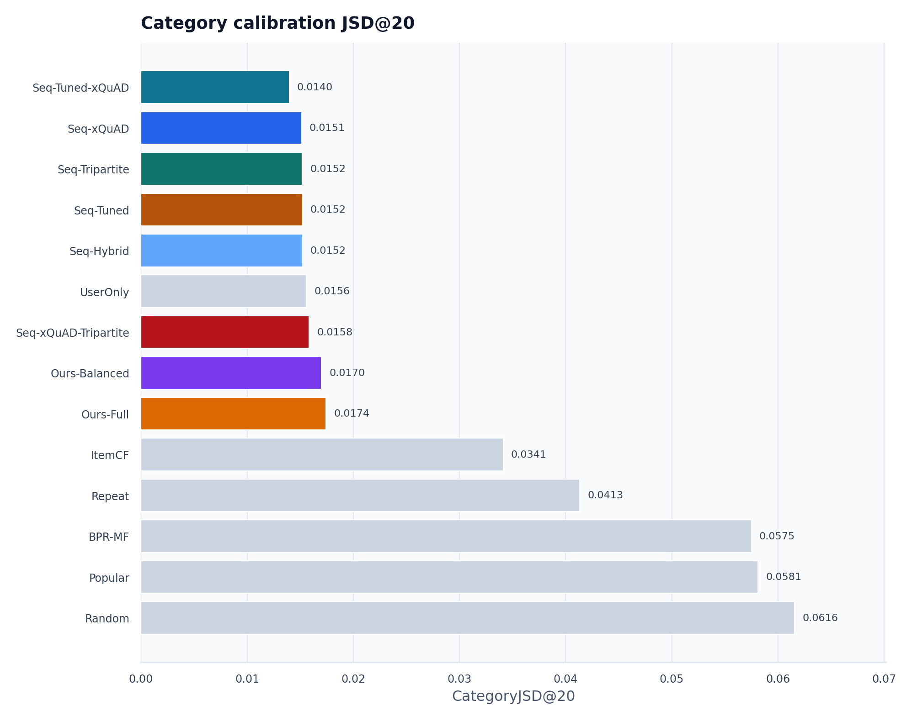

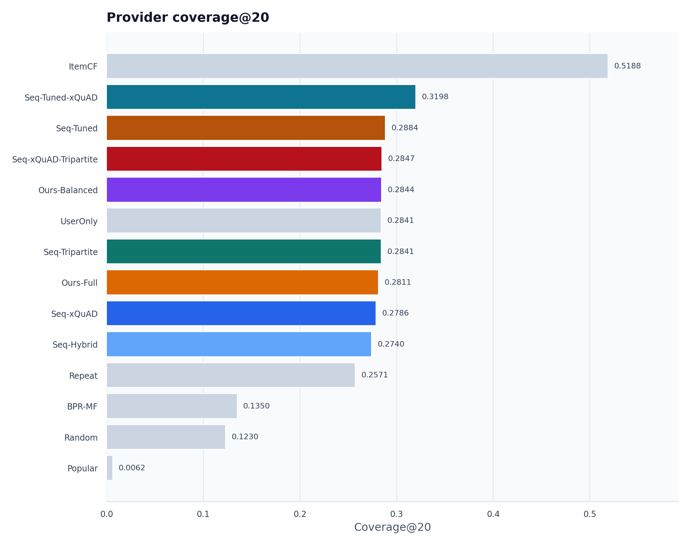

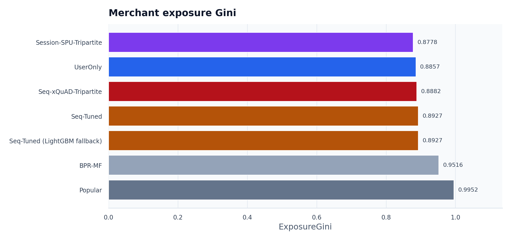

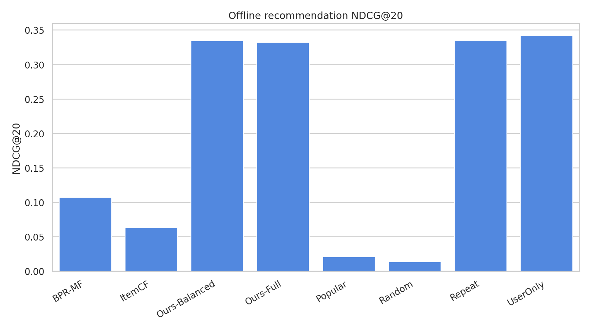

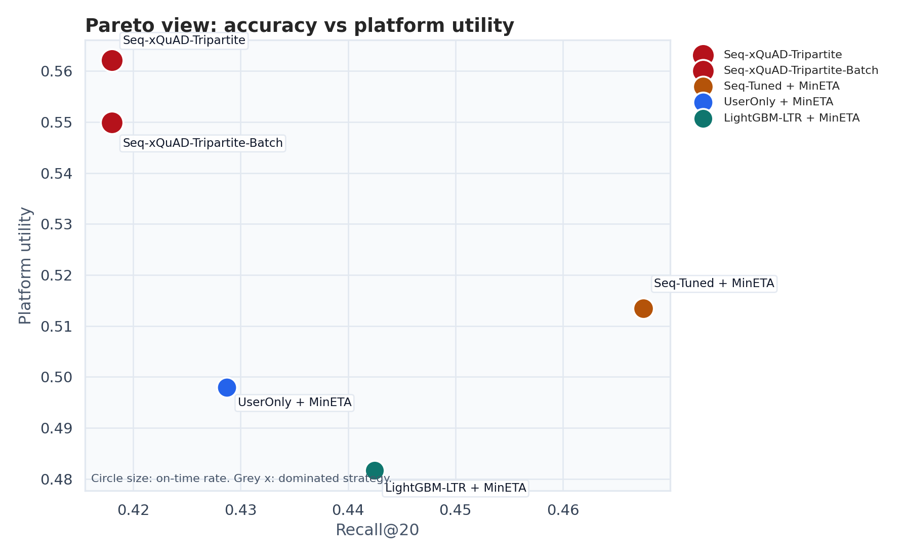

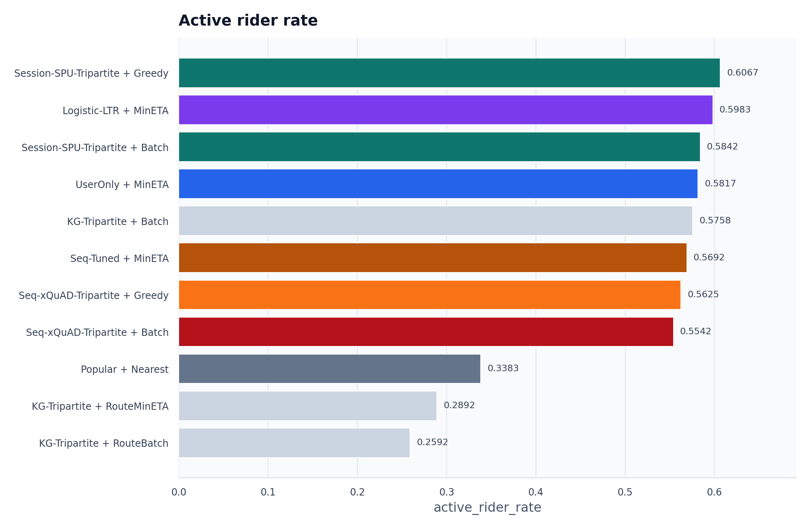

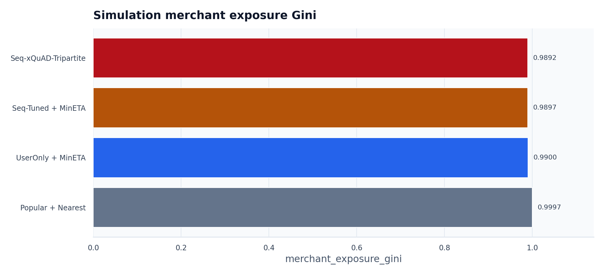

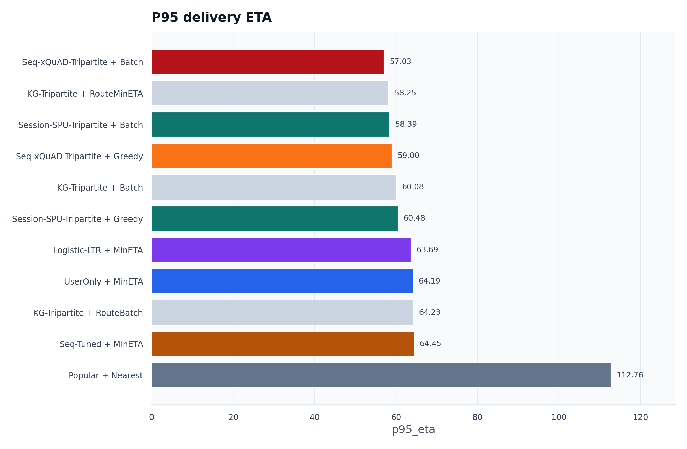

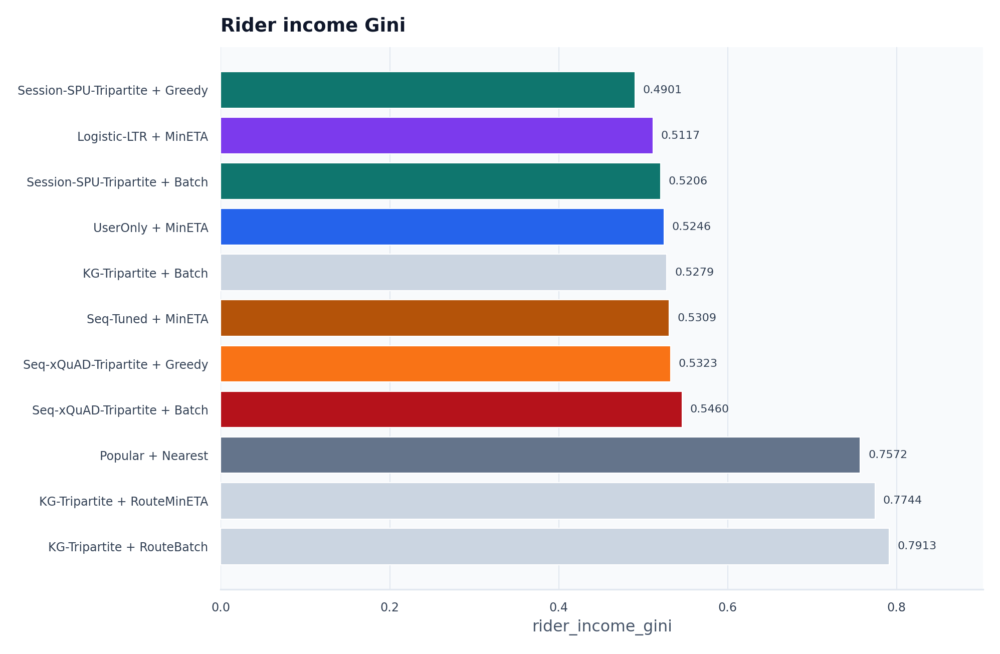

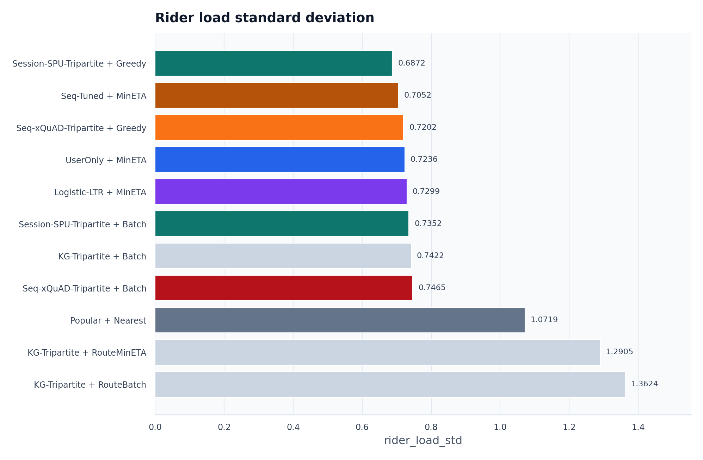

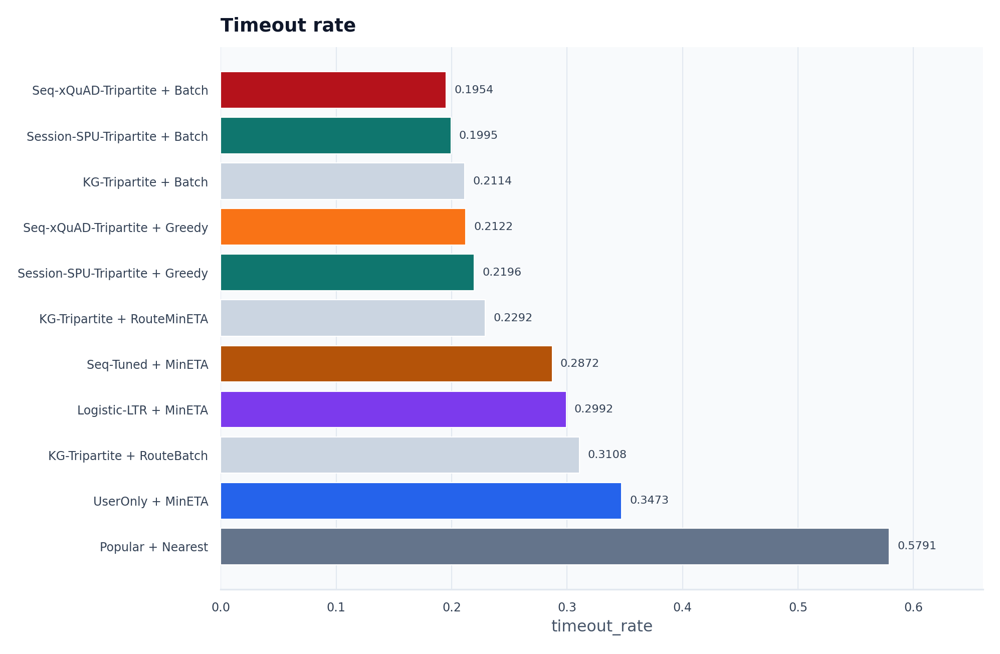

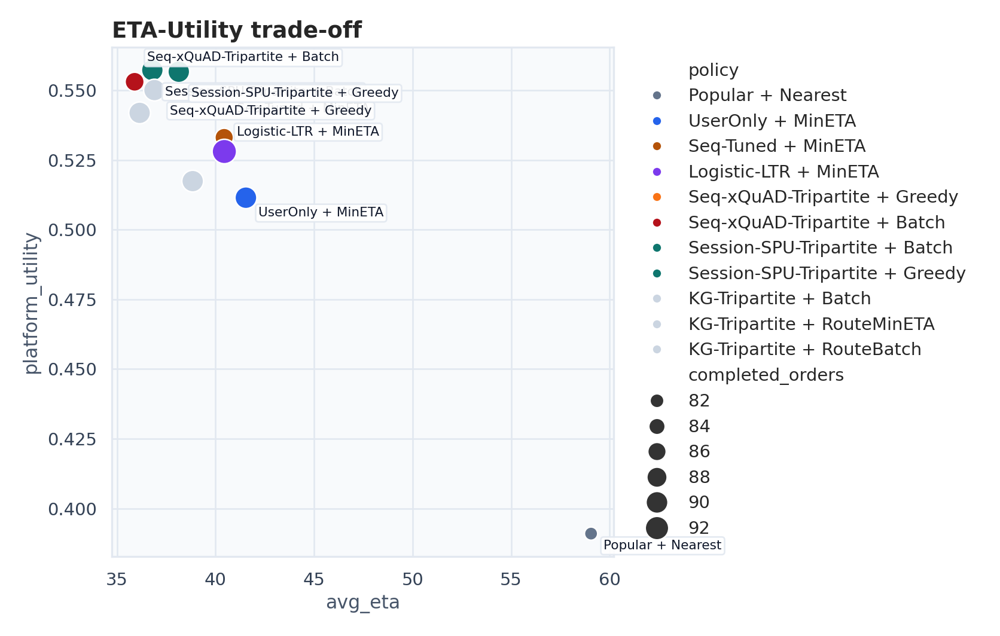

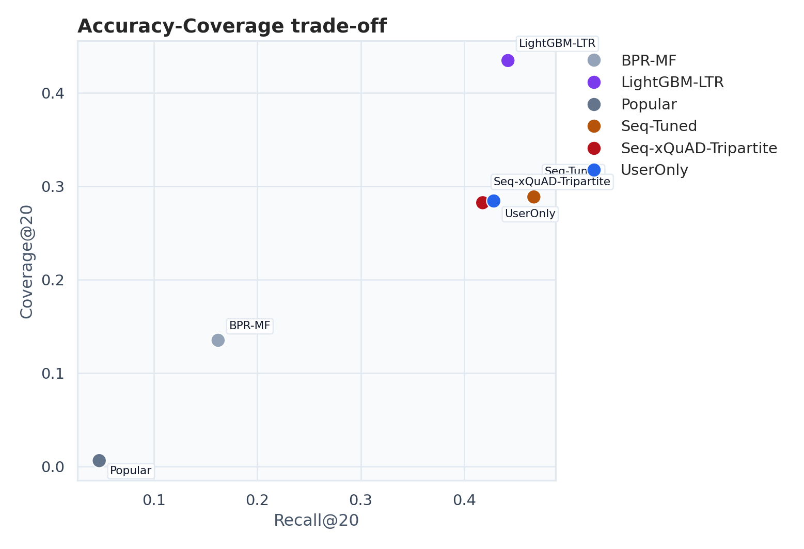

## 7. 结论与局限

FoodFlow 的答辩故事可以概括为三步：第一，公开外卖订单数据上的推荐实验说明模型不是随机的，并进一步利用 TRD session 点击、SPU 菜品信号和知识图谱兴趣路径；第二，引入 LightGBM-LTR 或其可解释 fallback，让序列特征权重不只依赖单一热度；第三，将推荐结果接入骑手履约仿真，并用批量二分图匹配、Session-SPU/KG 行为增强、多种子置信区间和 LaDe 可校准骑手参数说明准确性、公平性、ETA、超时率和平台效用之间的权衡。

局限是骑手数据默认来自合成仿真；LaDe 可用于校准末端配送速度、任务时长和负载分布，但仍不能替代工业级外卖派单数据。LightGBM-LTR 当前仍使用项目构造的候选集和特征，训练标签来自历史下单集合，后续可以进一步加入更丰富的上下文、真实曝光/点击标签和跨城市验证。
